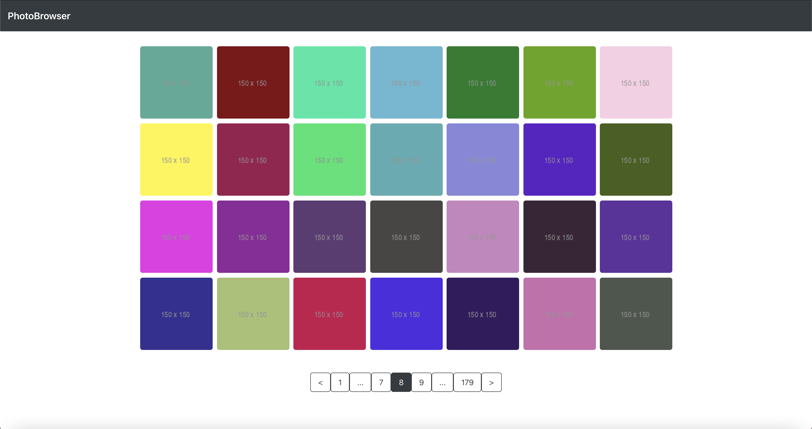
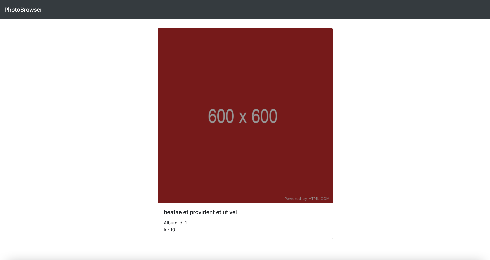

<h1 align="center">Welcome to PhotoBrowser application 👋</h1>

> PhotoBrowser is an application for users who like to browse photos. User can browse 
the photos form the home page and see more details about a certain photo by clicking on it.

### ✨ [Running version on Heroku](https://photobrowser-app.herokuapp.com/)

## Used technologies:
- React
- Bootstrap

## Prerequisites:
- axios
- react-bootstrap
- react-router-dom
- react-paginate

## How to use locally:

Clone the app and run it from your IDE. <br />
 
### Install:

```sh
npm install
```
#### You need to install the prerequisites separately, you can do:

```sh
npm install --save axios react-bootstrap react-router-dom react-paginate
```

### When the installation is complete:

```sh
npm start
```

## Images
### All photos 


### Photo details


## Bonus
- Pagination
- Responsive app
- Deployment on Heroku

## Author:

👤 **Abdullah Hinnawi**
- [Portfolio](https://abdullahhinnawi.com/)
- [Linkedin](https://www.linkedin.com/in/abdullah-hinnawi-426465198/)
- [GitHub](https://github.com/abdullahHinnawi)
